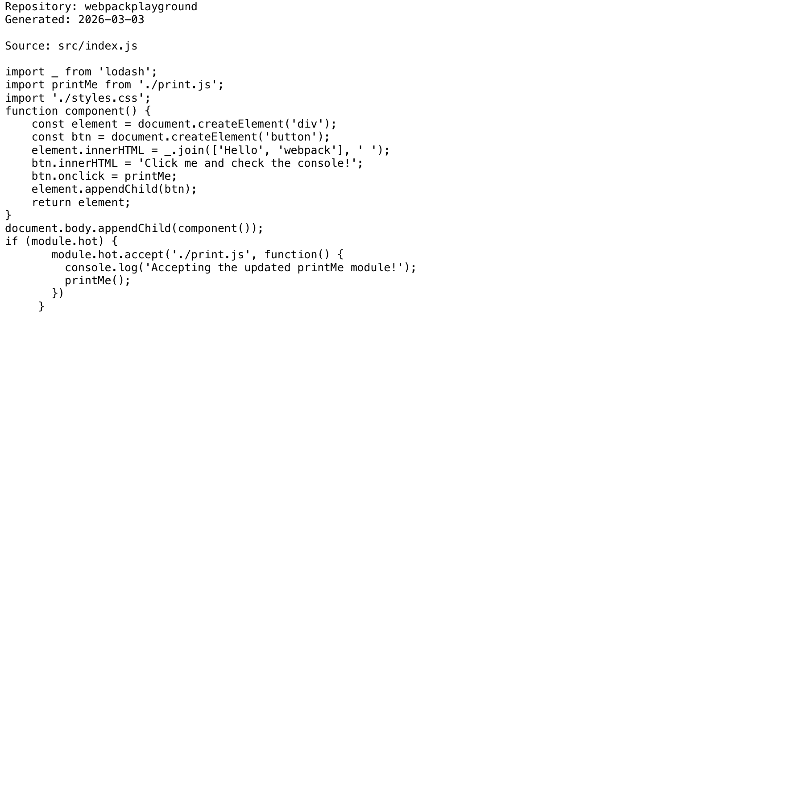

# Project Narrative & Proof

Generated: 2026-03-03

## User Journey
1. Discover the project value in the repository overview and launch instructions.
2. Run or open the build artifact for webpackplayground and interact with the primary experience.
3. Observe output/behavior through the documented flow and visual/code evidence below.
4. Reuse or extend the project by following the repository structure and stack notes.

## Design Methodology
- Iterative implementation with working increments preserved in Git history.
- Show-don't-tell documentation style: direct assets and source excerpts instead of abstract claims.
- Traceability from concept to implementation through concrete files and modules.

## Progress
- Latest commit: ccdc644 (2026-03-03) - docs: add professional README with badges
- Total commits: 2
- Current status: repository has baseline narrative + proof documentation and CI doc validation.

## Tech Stack
- Detected stack: Node.js, GitHub Actions, JavaScript, HTML/CSS

## Main Key Concepts
- Key module area: `src`

## What I'm Bringing to the Table
- End-to-end ownership: from concept framing to implementation and quality gates.
- Engineering rigor: repeatable workflows, versioned progress, and implementation-first evidence.
- Product clarity: user-centered framing with explicit journey and value articulation.

## Show Don't Tell: Screenshots


## Show Don't Tell: Code Excerpt
Source: `src/index.js`

```js
import _ from 'lodash';
import printMe from './print.js';
import './styles.css';
function component() {
    const element = document.createElement('div');
    const btn = document.createElement('button');
    element.innerHTML = _.join(['Hello', 'webpack'], ' ');
    btn.innerHTML = 'Click me and check the console!';
    btn.onclick = printMe;
    element.appendChild(btn);
    return element;
}
document.body.appendChild(component());
if (module.hot) {
       module.hot.accept('./print.js', function() {
         console.log('Accepting the updated printMe module!');
         printMe();
       })
     }
```
